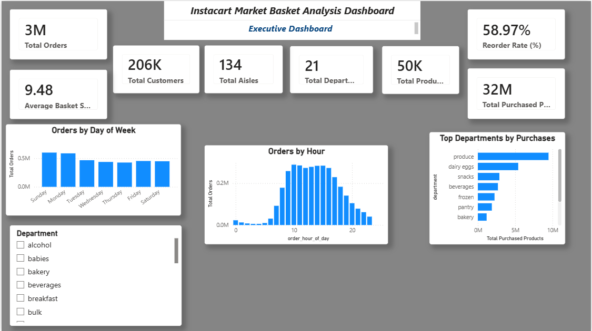
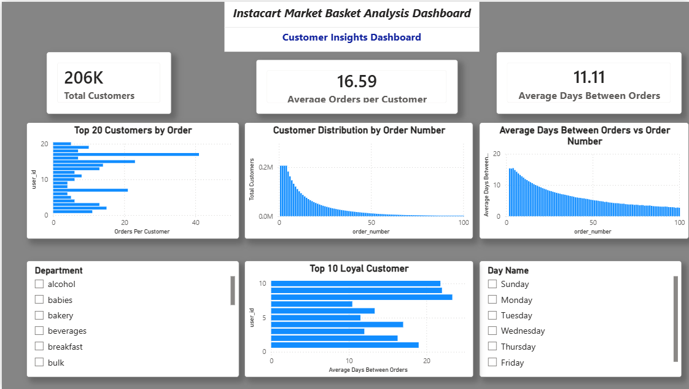
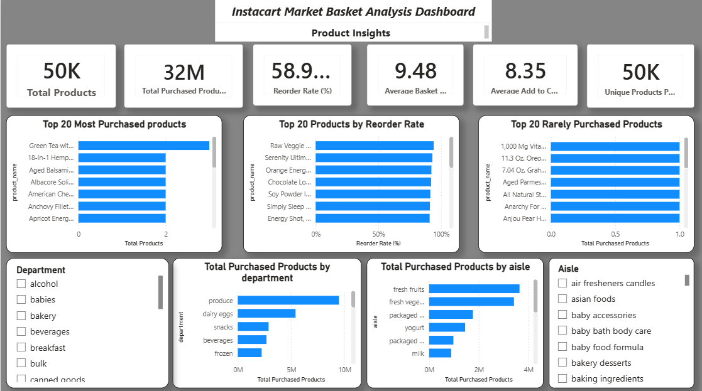
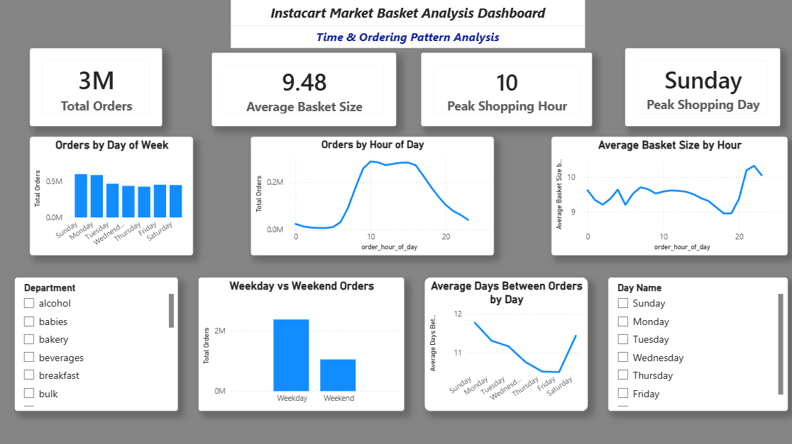

# 🛒 RetailIQ – Instacart Market Basket Analysis

## End-to-End Retail Analytics & Business Intelligence Project

**RetailIQ** is an end-to-end retail analytics project built using the **Instacart Market Basket Analysis dataset**.

The project analyzes historical grocery purchasing behavior to understand **customers, orders, products, departments, aisles, reorder behavior, basket size, and time-based purchasing patterns**.

The complete project follows a real-world analytics workflow:

> **Business Understanding → Data Understanding → Data Quality Assessment → Data Cleaning → Exploratory Data Analysis → SQL Business Analysis → Power BI Data Modeling → DAX & KPI Development → Interactive Dashboard → Business Insights → Business Recommendations**

The primary goal of this project is to transform raw transactional data into **actionable business insights** that can support customer retention, personalized marketing, product recommendations, inventory optimization, product bundling, and operational planning.

## Link of the PowerBI Dashboard
https://drive.google.com/file/d/1socXf9K0Yrkk_yF_urgHfOb1db9TVFIO/view?usp=drive_link


# 📌 Project Overview

Retail businesses generate large volumes of transactional data every day. When properly analyzed, this data can provide valuable insights into:

- Customer purchasing behavior
- Product demand
- Repeat purchasing patterns
- Customer loyalty
- Product popularity
- Department performance
- Aisle performance
- Peak ordering times
- Basket size
- Marketing opportunities
- Inventory planning

The **RetailIQ** project uses the Instacart Market Basket Analysis dataset to perform an end-to-end analysis of online grocery purchasing behavior.

The project combines:

- **Python** for data cleaning and exploratory data analysis
- **SQL** for business-focused analytical queries
- **Power BI** for data modeling, KPI development, and interactive dashboards

The project is designed as a portfolio project demonstrating practical skills required for **Data Analyst, Business Analyst, and entry-level Data Scientist roles**.

---

# 💼 Business Problem

An online grocery retailer has a large amount of historical customer transaction data but needs to understand how customers and products behave.

The business wants to answer questions such as:

- Which customers are the most active?
- Which customers are likely to be loyal?
- Which products are purchased most frequently?
- Which products are reordered most often?
- Which departments generate the highest purchase volume?
- Which aisles are the most popular?
- Which products are rarely purchased?
- When are customers most active?
- What time of day produces the largest baskets?
- How does weekday behavior differ from weekend behavior?

Without structured analytics, transactional data cannot easily be converted into actionable business decisions.

The RetailIQ project addresses this problem by building a complete analytical workflow that transforms raw transaction data into business insights.

---

# 🎯 Business Objectives

The major objectives of this project are:

1. Understand the structure and relationships of the Instacart dataset.
2. Perform data quality assessment.
3. Clean and prepare the data for analysis.
4. Analyze customer purchasing behavior.
5. Identify the most active customers.
6. Analyze customer reorder behavior.
7. Identify the most popular products.
8. Analyze product reorder rates.
9. Identify rarely purchased products.
10. Analyze department-level purchasing behavior.
11. Analyze aisle-level purchasing behavior.
12. Identify high-performing departments and aisles.
13. Analyze ordering patterns by day and hour.
14. Compare weekday and weekend behavior.
15. Analyze average basket size.
16. Answer real-world business questions using SQL.
17. Create an interactive Power BI dashboard.
18. Develop KPIs and DAX measures.
19. Generate actionable business insights.
20. Provide data-driven business recommendations.

---

# ❓ Key Business Questions

The project addresses business questions across six major analytical areas.

## Basic Metrics

- How many unique customers are present?
- How many total orders were placed?
- How many unique products are available?
- What is the average number of orders per customer?
- What is the average basket size?

## Customer Analysis

- Who are the top customers by number of orders?
- Which customers purchased the highest number of products?
- Which customers have the highest reorder rates?
- Which customers placed only one order?
- Which customers demonstrate stronger loyalty?
- How frequently do customers return to place new orders?

## Product Analysis

- Which products are purchased most frequently?
- Which products have the highest reorder rates?
- Which products are rarely purchased?
- Which products appear in the highest number of unique orders?
- Which products contribute most to customer baskets?

## Department & Aisle Analysis

- Which departments receive the highest number of purchases?
- Which aisles are the most popular?
- Which departments have the highest reorder rates?
- Which aisles have the highest reorder rates?

## Time-Based Analysis

- Which day of the week has the highest number of orders?
- Which hour of the day has the highest customer activity?
- What is the average basket size by hour?
- How does weekday behavior differ from weekend behavior?

## Advanced Business Analysis

- What are the top 10 products within each department?
- Who are the top 5 customers in each department?
- How does cumulative order volume change over time?
- Which customers purchased more products in their latest order than their previous order?
- Which products have reorder rates higher than their department average?
- How do departments rank by average basket size?

---

# 🗂️ Dataset Overview

The project uses the **Instacart Market Basket Analysis dataset**.

The analytical model uses five primary tables:

1. `orders`
2. `order_products__prior`
3. `products`
4. `aisles`
5. `departments`

The project focuses on historical order and product purchasing behavior.

---

# 📋 Dataset Tables

## 1. Orders

The `orders` table contains information about customer orders.

### Important Columns

| Column | Description |
|---|---|
| `order_id` | Unique identifier for each order |
| `user_id` | Identifier for the customer |
| `order_number` | Sequential order number for a customer |
| `order_dow` | Day of week when the order was placed |
| `order_hour_of_day` | Hour when the order was placed |
| `days_since_prior_order` | Number of days since the customer's previous order |

### Primary Key

`order_id`

### Excluded Column

The `eval_set` column was excluded from the analytical model because it was not required for the business analysis.

---

## 2. Order Products Prior

The `order_products__prior` table contains the products purchased in previous orders.

### Important Columns

| Column | Description |
|---|---|
| `order_id` | Identifier of the order |
| `product_id` | Identifier of the product |
| `add_to_cart_order` | Position in which the product was added to the cart |
| `reordered` | Indicates whether the product was reordered |

### Key Structure

The combination of:

`order_id + product_id`

acts as the composite key.

This table connects customer orders with purchased products.

---

## 3. Products

The `products` table contains product-level information.

### Important Columns

| Column | Description |
|---|---|
| `product_id` | Unique product identifier |
| `product_name` | Name of the product |
| `aisle_id` | Identifier of the aisle |
| `department_id` | Identifier of the department |

### Primary Key

`product_id`

---

## 4. Aisles

The `aisles` table contains information about product aisles.

### Columns

| Column | Description |
|---|---|
| `aisle_id` | Unique aisle identifier |
| `aisle` | Name of the aisle |

### Primary Key

`aisle_id`

---

## 5. Departments

The `departments` table contains department-level information.

### Columns

| Column | Description |
|---|---|
| `department_id` | Unique department identifier |
| `department` | Name of the department |

### Primary Key

`department_id`

---

# 🚫 Excluded Data

The following were excluded from the analytical project:

- `order_products__train`
- `order_products__test`
- `eval_set` column from `orders`

The analysis focuses on the historical transactional data represented by the selected five-table model.

---

# 🏗️ Data Model

The project uses a relational data model.

The primary relationships are:

```text
departments
     │
     │ 1 : Many
     ▼
products
     │
     │ 1 : Many
     ▼
order_products__prior
     ▲
     │ Many : 1
     │
orders

aisles
   │
   │ 1 : Many
   ▼
products
```

---

# 📊 Power BI Dashboard

The interactive Power BI dashboard is available [here](https://drive.google.com/file/d/1socXf9K0Yrkk_yF_urgHfOb1db9TVFIO/view?usp=drive_link). The screenshots below provide a preview of its four report pages.

## Dashboard Page 1 – Executive Dashboard



## Dashboard Page 2 – Customer Insights



## Dashboard Page 3 – Product Insights



## Dashboard Page 4 – Time & Ordering Analysis


